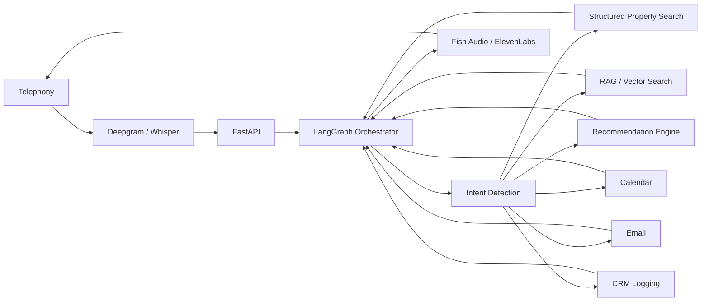

# Production-Grade AI Voice Agent for Real Estate — Week 4 Capstone

A production-oriented reference implementation for a real-estate conversational voice agent with:
- UrduLish conversational persona
- LangGraph-style orchestration
- structured property retrieval + semantic/RAG retrieval
- property recommendation
- appointment booking / rescheduling / cancellation
- email and CRM workflow abstractions
- guardrails and prompt-injection protection
- evaluation suite and monitoring
- FastAPI backend
- Docker deployment configuration

## Important implementation note

This repository is designed to be runnable without paid external APIs. External voice, LLM, Google Calendar,
Gmail, PostgreSQL and vector-database integrations are represented by adapters with deterministic demo/mock
implementations. Replace adapter internals and environment variables for a live client deployment.

## Architecture



## Run locally

```bash
python -m venv .venv
# Windows:
.venv\Scripts\activate
# macOS/Linux:
source .venv/bin/activate

pip install -r requirements.txt
uvicorn app.main:app --reload
```

Open:
- `http://127.0.0.1:8000/docs`
- `http://127.0.0.1:8000/health`

##  endpoints

- `GET /health`
- `GET /properties`
- `POST /chat`
- `POST /recommend`
- `POST /appointments/book`
- `POST /appointments/reschedule`
- `POST /appointments/cancel`
- `GET /appointments`
- `POST /evaluate`

## Example chat

```json
{
  "session_id": "demo-001",
  "message": "Assalam-o-Alaikum, mera budget 3 crore hai aur DHA mein family ke liye 4 bed option chahiye."
}
```

The demo engine uses the CSV data in `data/properties.csv`, so the result is grounded in the provided
property catalog rather than invented live listings.

